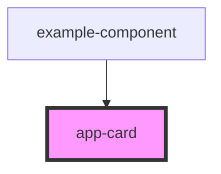

# app-card

<!-- Auto Generated Below -->

## Properties

| Property    | Attribute    | Description | Type     | Default     |
| ----------- | ------------ | ----------- | -------- | ----------- |
| `cardText`  | `card-text`  |             | `string` | `undefined` |
| `cardTitle` | `card-title` |             | `string` | `undefined` |
| `imgUrl`    | `img-url`    |             | `string` | `undefined` |

## Dependencies

### Used by

 - [example-component](../example-component)

### Graph

----------------------------------------------

