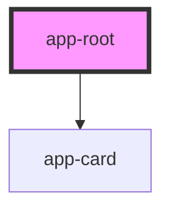

# app-root

<!-- Auto Generated Below -->

## Properties

| Property     | Attribute     | Description | Type     | Default             |
| ------------ | ------------- | ----------- | -------- | ------------------- |
| `imageOne`   | `image-one`   |             | `string` | `'logoVI.png'`      |
| `imageThree` | `image-three` |             | `string` | `'logoReact.png'`   |
| `imageTwo`   | `image-two`   |             | `string` | `'logoStencil.png'` |

## Dependencies

### Depends on

- [app-card](../app-card)

### Graph

----------------------------------------------

